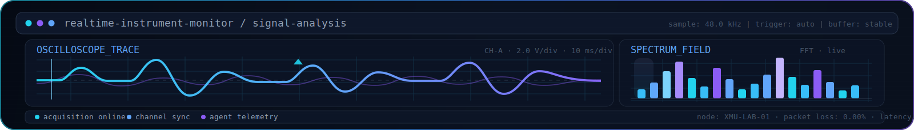
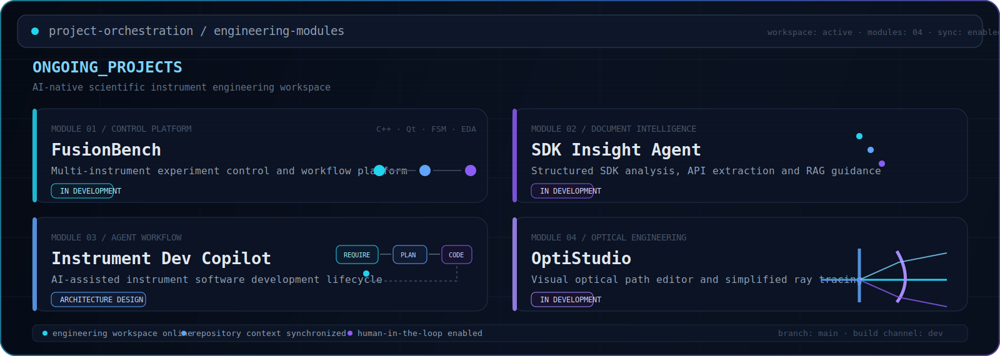

   

  

   

  

---

<table>
<tr>
<td width="50%" valign="top">

## `SYSTEM_FOCUS`

Instrument Control Software
RAG and Agent Systems
AI Document Analysis
Control Science
Scientific Engineering Workflows

---
TECH_STACK

 
    

---
LAB_MISSION

Building AI-native tools for scientific instrument development.

Turning fragmented SDKs, technical documentation, hardware interfaces and
experimental requirements into structured, reusable and AI-assisted
engineering workflows.

<b>GITHUB_SIGNAL / Open analytics channel</b>

 

  

  

 

  

