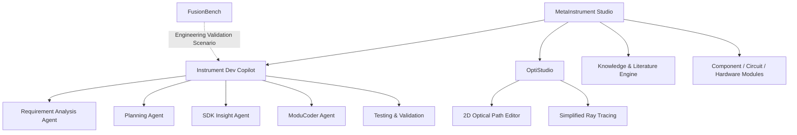

<<<<<<< HEAD

  
  
  

---

## 👨‍💻 About Me

I work at the intersection of **AI application engineering**, **scientific instrument software**, and **engineering system development**.

- 🤖 **AI Application Engineering**  
  RAG, Agents, intelligent SDK analysis, coding agents, document intelligence and workflow-oriented AI applications.

- 🔬 **Scientific Instrument Software**  
  Motion stages, spectrometers, Raman systems, TERS and multi-instrument control platforms.

- 🛠️ **Engineering Development**  
  C++, Qt, Python, Linux, hardware control, device communication and SDK integration.

I am especially interested in turning complex documentation, hardware SDKs and experimental requirements into structured, reusable and AI-assisted engineering workflows.

---

## 🧭 Main Focus

<table>
<tr>
<td width="33%" valign="top">

### 🤖 AI Applications

- RAG systems
- LLM Agents
- SDK intelligence
- Coding agents
- Document processing
- Multi-agent workflows

</td>
<td width="33%" valign="top">

### 🔬 Instrument Software

- Motion-stage control
- Spectrometer software
- Raman / TERS systems
- Multi-instrument control
- Experiment workflows
- Data acquisition

</td>
<td width="33%" valign="top">

### ⚙️ Engineering

- C++ / Qt
- Python
- Linux
- Hardware control
- SDK integration
- Modular architecture

</td>
</tr>
</table>

---

## 🛠️ Tech Stack

  

---

## 🚧 Current Projects

<table>
<tr>
<td width="50%" valign="top">

### 🔬 FusionBench
**Multi-Instrument Experiment Control Platform**  
`In Development`

A modular desktop platform for coordinating multiple scientific instruments through **Finite State Machines**, **Event-Driven Architecture** and configurable experimental workflows.

**Current focus**

- Instrument state and lifecycle management
- Event-driven communication between modules
- Multi-device synchronization
- Hardware abstraction and SDK integration
- Experiment workflow orchestration

`C++` `Qt` `Python` `FSM` `EDA`

</td>
<td width="50%" valign="top">

### 🧠 SDK Insight Agent
**Intelligent SDK Documentation Analysis Agent**  
`In Development`

An AI agent that transforms fragmented SDK documentation into structured, retrievable and development-ready knowledge.

**Current focus**

- Document preprocessing strategies
- Header hierarchy recovery
- API and dependency extraction
- Chunking and metadata design
- RAG-based SDK question answering
- Context-aware development guidance

`Python` `RAG` `Document Intelligence`

</td>
</tr>

<tr>
<td width="50%" valign="top">

### 🧩 ModuCoder Agent
**Modular Coding Agent**  
`Learning & Planning`

A planned coding agent for structured engineering development rather than isolated code generation.

**Planned capabilities**

- Requirement-to-module decomposition
- Interface-aware code generation
- Repository-level context understanding
- Test generation and execution feedback
- Module-level debugging and repair
- Human-controlled iterative modification

`Coding Agent` `Architecture` `Testing`

</td>
<td width="50%" valign="top">

### 🖥️ Instrument Dev Copilot
**AI-Assisted Scientific Instrument Software Development Platform**  
`Architecture Designing`

A planned multi-agent workflow for the complete development lifecycle of scientific instrument desktop software.

**Proposed agents**

- Requirement Analysis Agent
- Planning Agent
- SDK Insight Agent
- ModuCoder Agent
- Testing and Validation Modules

`Multi-Agent System` `RAG` `Qt` `C++`

</td>
</tr>

<tr>
<td width="50%" valign="top">

### 🔭 OptiStudio
**Visual Optical Path Design & Simplified Ray-Tracing Tool**  
`In Development`

A visual front-end for designing optical systems with a two-dimensional optical path editor and simplified ray tracing.

**Core capabilities**

- Add and edit optical components
- Drag, rotate and configure elements
- Build 2D optical layouts
- Visualize light propagation
- Perform simplified ray tracing
- Export clear optical system diagrams

`Optical Design` `2D Editor` `Ray Tracing`

</td>
<td width="50%" valign="top">

### 🏗️ MetaInstrument Studio
**End-to-End AI Platform for Scientific Instrument Development**  
`Long-term Vision & Early Design`

An intelligent engineering platform designed to support the complete journey from an early instrument idea to an implementable research prototype.

**Planned workflow**

- Literature and technical-resource search
- Internal knowledge-base retrieval
- Multi-turn requirement clarification
- Instrument architecture generation
- Component selection and circuit references
- Optical design and control-software assistance
- Iterative end-to-end engineering refinement

`AI Agents` `Knowledge Base` `Instrument Design`

</td>
</tr>
</table>

---

## 🧬 Project Architecture

---

## 📊 GitHub Analytics

 

 

---

## 🎯 What I Am Building Toward

> An AI-native engineering environment for scientific instrument development —  
> connecting knowledge retrieval, requirement analysis, SDK understanding, optical design, modular coding, hardware integration and experimental workflows.

---

### 📫 Connect

<!-- Replace the email address below with your own email before publishing. -->

  

=======
## Hi there 👋

<!--
**Muilrz/Muilrz** is a ✨ _special_ ✨ repository because its `README.md` (this file) appears on your GitHub profile.

Here are some ideas to get you started:

- 🔭 I’m currently working on ...
- 🌱 I’m currently learning ...
- 👯 I’m looking to collaborate on ...
- 🤔 I’m looking for help with ...
- 💬 Ask me about ...
- 📫 How to reach me: ...
- 😄 Pronouns: ...
- ⚡ Fun fact: ...
-->
>>>>>>> 9fb8a330b7e246b7171a6f790b33009e11fc51e2
